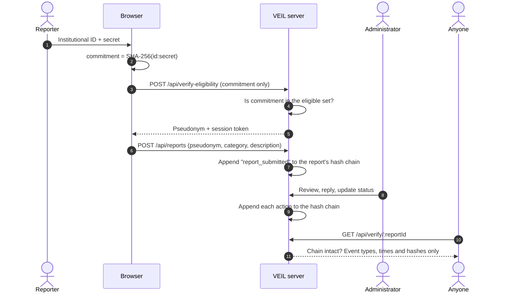
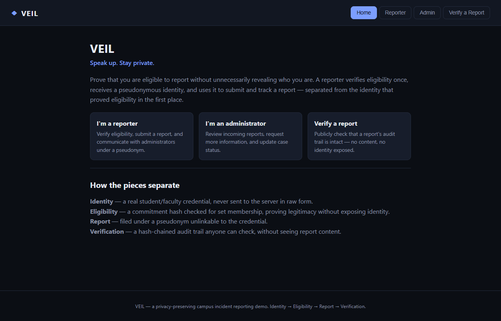
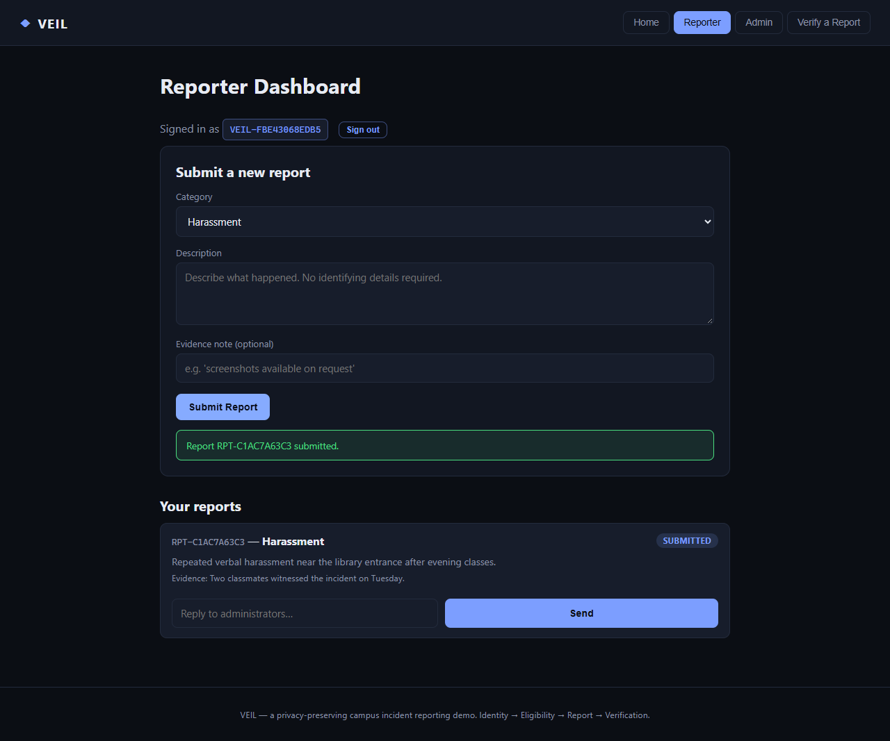
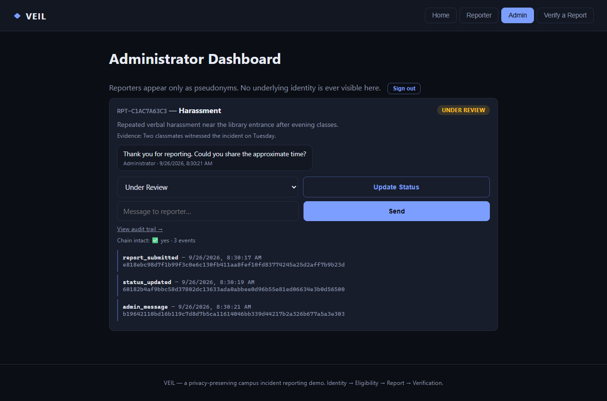
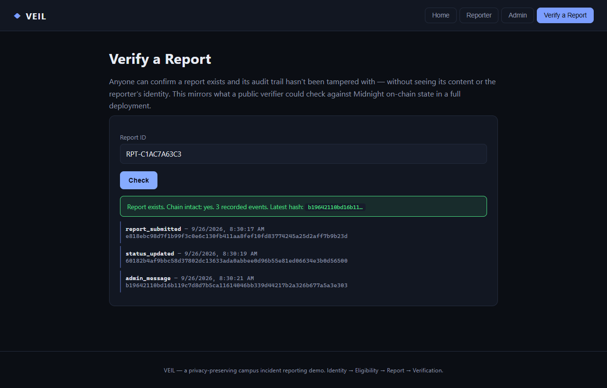

# 🕯️ VEIL

[](https://github.com/ShambhaviCode/veil/actions/workflows/test.yml)

### Privacy-Preserving Campus Incident Reporting

**Prove you're eligible to report without revealing who you are.**

> **Speak up. Stay private.**

**[Live demo](https://veil-zeta-rosy.vercel.app)** · [Screenshots](#-screenshots) · [Run locally](#run-locally)

---

## 💡 Inspiration

Anonymous reporting has a fundamental trade-off: institutions need to verify that a report comes from a legitimate member, while reporters may fear revealing their identity.

**VEIL separates the proof from the person.**

```text
Identity → Eligibility → Report → Verification
```

---

## 🚀 What It Does

VEIL lets verified institutional members submit and track incident reports using a **pseudonymous identity**.

**Reporters**

* Verify eligibility
* Submit reports
* Stay pseudonymous
* Track status
* Communicate anonymously

**Administrators**

* Review reports
* Request information
* Respond to reporters
* Manage status
* Maintain an audit trail

**Verified reporter. Protected identity. Accountable report.**

---

## 🔄 How It Works

The raw credential never leaves the browser, the report is filed under a pseudonym, and anyone can check a report's audit trail without seeing its content.



---

## 📸 Screenshots

| Home | Reporter dashboard |
| --- | --- |
|  |  |
| **Administrator dashboard** | **Public verification** |
|  |  |

---

## 🛠️ Built With

* **Frontend:** HTML, CSS, Vanilla JavaScript
* **Backend:** Node.js
* **Privacy:** Midnight
* **Smart Contracts:** Compact
* **Verification:** Zero-knowledge proof design

Sensitive report content stays **off-chain**.

---

## 🔐 Why Midnight?

Midnight is used where privacy and verifiability matter.

The Compact layer handles eligibility and integrity logic while the application keeps sensitive reporting data private.

**Blockchain is not used as a database for personal information.**

---

## 🏆 Highlights

* Privacy-first reporting workflow
* Eligibility verification
* Pseudonymous identities
* Anonymous two-way communication
* Admin dashboard
* Report status tracking
* Audit & public verification
* Midnight Compact integration

---

## 🧩 Challenges

* Making Midnight meaningful rather than decorative
* Designing what should be private vs. verifiable
* Integrating evolving Midnight tooling
* Delivering a complete workflow within hackathon scope

---

## 📚 What We Learned

**Privacy and accountability don't have to be opposites.**

The key question became:

> **How can a system verify a claim without requiring it to know everything about the person?**

That principle shaped VEIL's architecture.

---

## 🔮 What's Next

* Anonymous credentials
* Institutional digital credentials
* Encrypted evidence
* Emergency reporting
* Case escalation
* Mobile apps
* Cross-institution verification

---

## 🌐 Demo

**Live:** https://veil-zeta-rosy.vercel.app

### Run locally

```bash
node server.js
```

Then open:

```text
http://localhost:8787
```

Demo credentials and an admin token are printed on startup.

Run the tests (Node 18+, no dependencies):

```bash
node --test
```

---

## ⚠️ Current Status

The Compact verification logic is currently modeled with equivalent server-side hashing and set-membership checks.

The intended circuit is:

```text
contracts/report_verification.compact
```

**The contract is not yet deployed on-chain.**

Reports are kept in a JSON file (`data/store.json` locally, or the directory
set by `VEIL_DATA_DIR`). On Vercel, or wherever `data/` isn't writable, the
store lives in the system temp directory instead, so live-demo data is not
persistent and can reset between requests that land on different instances.

---

## 📄 License

MIT

## 👩‍💻 Developer

**Shambhavi** 
---


